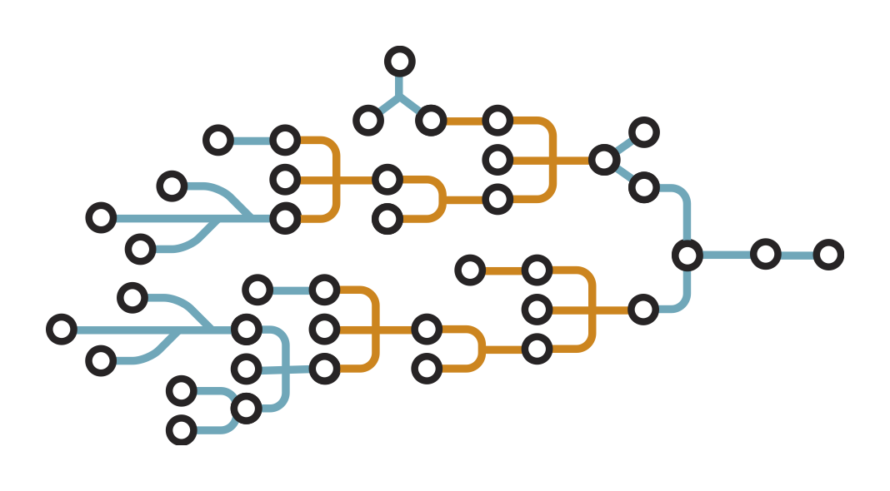

# BuildKit: 建立在containerd之上的现代构建工具包
## 是什么
BuildKit是一个工具包，用于以有效，可表达和可重复的方式将源代码转换为构建工件。
官网介绍如下：
>BuildKit是Moby旗下的一个新项目，用于使用容器构建和打包软件。这是一个新的代码库，旨在替代Moby Engine中当前构建功能的内部。

主要特性:
* Automatic garbage collection（自动垃圾回收）
* Extendable frontend formats（可扩展的前端格式）
* Concurrent dependency resolution（并发依赖性解析）
* Efficient instruction caching（高效的指令缓存）
* Build cache import/export（构建缓存导入导出）
* Nested build job invocations（嵌套的构建job调用）
* Distributable workers（分布式多worker构建）
* Multiple output formats（多平台格式输出）
* Pluggable architecture（可插拔架构）
* Execution without root privileges（不需要root权限执行）
## 为什么
与传统docker build相比，有哪些改进，解决了什么问题？
简单来说：
* 性能更好
    * 并发构建
    * 更好的缓存系统
* 功能更多，更灵活
* 更安全，rootless
### LLB
> LLB is to Dockerfile what LLVM IR is to C

BuildKit的核心是一种称为LLB（低级构建器）的新的低级构建定义格式。这是一种中间二进制格式，最终用户不了解这种格式，但可以轻松地在BuildKit之上进行构建。LLB定义了一个内容可寻址的依赖关系图，可用于将非常复杂的构建定义放在一起。它还支持Dockerfile中未公开的功能，例如直接数据挂载和嵌套调用。

关于构建的执行和缓存的所有内容仅在LLB中定义。与当前的Dockerfile构建器相比，缓存模型被完全重写。无需进行试探法来比较图像，它可以直接跟踪构建图和装入特定操作的内容的校验和。这使得它更快，更精确和更便携。构建缓存甚至可以导出到注册表，在该注册表中，可以通过对任何主机的后续调用按需将其拉出。
可以使用golang客户端软件包直接生成LLB，该软件包允许使用Go语言原语定义构建操作之间的关系。这给了您完全的能力来运行您可以想象的任何东西，但可能不是大多数人定义其构建的方式。相反，我们希望大多数用户使用前端组件或LLB嵌套调用来运行构建步骤的某些组合。
前端是采用人类可读的构建格式并将其转换为LLB的组件，以便BuildKit可以执行它。可以将前端作为图像进行分发，并且用户可以指定特定版本的前端，以保证可以使用其定义所使用的功能。例如，要使用BuildKit构建Dockerfile，您将使用外部Dockerfile前端。

总结：LLB是负责解释Dockerfile命令的，并分析其中的并发依赖性，然后交由buildkit并发执行构建，通过不同的LLB，buildkit可以使用多种配置文件进行构建，官方支持的LLB有：
* Buildpacks
* Mockerfile
* Gockerfile
* Docker Assemble

### 多平台构建
BuildKit的设计可很好地用于多个平台的构建，而不仅适用于用户调用该构建运行的体系结构和操作系统。

调用构建时，使用`--platform`标志可用于指定构建输出的目标平台（例如`linux/amd64`，`linux/arm64`，`darwin/amd64`）。当当前构建器实例由“ docker-container”驱动程序支持时，可以一起指定多个平台。在这种情况下，将构建清单清单，其中包含所有指定体系结构的图像。在docker run或中使用此映像时docker service，Docker将根据节点的平台选择正确的映像。
> 跨 CPU 架构编译程序的方法
    1. 直接在目标硬件上编译
    2. 模拟目标硬件-虚拟机
    3. 通过 binfmt_misc 模拟目标硬件的用户空间：在 Linux 上，QEMU 除了可以模拟完整的操作系统之外，还有另外一种模式叫用户态模式（User mod）。该模式下 QEMU 将通过 binfmt_misc 在 Linux 内核中注册一个二进制转换处理程序，并在程序运行时动态翻译二进制文件，根据需要将系统调用从目标 CPU 架构转换为当前系统的 CPU 架构。最终的效果看起来就像在本地运行目标 CPU 架构的二进制文件。
    通过 QEMU 的用户态模式，我们可以创建轻量级的虚拟机（chroot 或容器），然后在虚拟机系统中编译程序，和本地编译一样简单轻松。后面我们就会看到，跨平台构建 Docker 镜像用的就是这个方法。
    4. 使用交叉编译器
### 多镜像格式输出
* Docker tarball
```bash
# exported tarball is also compatible with OCI spec
buildctl build ... --output type=docker,name=myimage | docker load
```
> 可以设置build完成后自动push
* OCI tarball
```bash
buildctl build ... --output type=oci,dest=path/to/output.tar
buildctl build ... --output type=oci > output.tar
```
### Cache
* cache垃圾回收
在`/etc/buildkit/buildkitd.toml`进行配置
https://github.com/moby/buildkit/blob/master/docs/buildkitd.toml.md
* export
    * inline：将缓存嵌入到映像中，然后将它们一起推送到注册表
    * registry：分别推送图像和缓存
    * local：导出到本地目录

在大多数情况下，您想使用inline缓存导出器。但是，请注意，inline缓存导出器仅支持min缓存模式。要启用max缓存模式，请使用registry缓存导出器分别推送图像和缓存。
* import
```bash
buildctl build ... --import-cache type=local,src=path/to/input-dir 
```
### Dockerfile高级语法支持
* RUN --mount=type=bind
默认类型，允许将上下文或映像中的目录（只读）绑定到构建容器。
* RUN --mount=type=cache
允许构建容器为编译器和程序包管理器缓存目录。
* RUN --mount=type=tmpfs
允许将tmpfs安装在构建容器中。
* RUN --mount=type=secret
允许构建容器访问安全文件（例如私钥）而无需将其烘焙到映像中。
* RUN --mount=type=ssh
允许构建容器通过SSH代理访问SSH密钥，并支持passphrases。
* RUN --security=insecure|sandbox
* RUN --network=none|host|default
控制在哪个网络环境中运行命令。
> 这些语法目前属于实验性质

主要应用场景：
* 使用--mount=type=cache加速代码编译
* 使用--mount=type=secret在构建容器内登录或认证
### Kubernetes支持
Buildkit支持部署在k8s中，提供镜像构建服务，官方提供了部署yaml，几种部署方案优缺点：
* Pod: good for quick-start
* Deployment + Service: good for random load balancing with registry-side cache
* StateFulset: good for client-side load balancing, without registry-side cache
* Job: good if you don't want to have daemon pods
## 怎样使用
* Docker, docker buildx
* img
* Tekton
* Rio
> With or without daemon, in container, in k8s, with containerd daemon, without root privileges, etc
## 现状
* Buildkit项目star数：2.3k
* docker/buildx项目star数：408
* 其他
    kubernetes/ingress-nginx项目中使用了buildx的多平台构建
## Todo
* LLB原理，最佳实践，应用场景及价值
* Docker build缓存原理及与Buildkit的差异，构建镜像时应不应该使用`--no-cache`
* 在k8s CI中的应用调研，是否主流CI工具都已支持？
