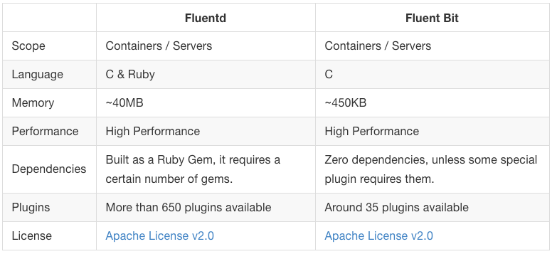
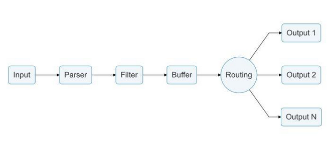

# Kubernetes集群中日志收集方案-EFK
- Fluentd是一个流行的开源数据收集器，我们将在 Kubernetes 集群节点上安装 Fluentd，通过获取容器日志文件、过滤和转换日志数据，然后将数据传递到 Elasticsearch 集群，在该集群中对其进行索引和存储
- fluentd bit是纯C写的，功能与fluentd类似，与k8s的结合更深 https://github.com/fluent/fluent-bit-docs



## fluent-bit流程


## 日志收集方式
- 日志均以标准的stderr和stdout输出，这个一般输出的格式取决于docker的日志驱动，一般为json-file，在/var/log/containers/目录里
- 日志输出到持久化存储落盘

## 部署方案
- Fluent-bit以DaemonSet部署到k8s节点
- Fluent-bit以sidecar方式部署到应用pod


## DaemonSet方式部署
example/elasticsearch.yaml
```
...
# ES集群节点个数
  replicas: 3
...
# ES实例资源配额
        resources:
            limits:
              cpu: 1000m
            requests:
              cpu: 100m
#ES进程内存分配
          - name: ES_JAVA_OPTS
            value: "-Xms512m -Xmx512m"
#ES存储大小
  volumeClaimTemplates:
  - metadata:
      name: data
      labels:
        app: elasticsearch
    spec:
      accessModes: [ "ReadWriteOnce" ]
      resources:
        requests:
          storage: 20Gi
```
```
kubectl apply -f example/elasticsearch.yaml
kubectl apply -f example/kibana.yaml 
```
example/fluent-bit.yaml
> 收集K8S集群所有pod日志
```
    @INCLUDE input-kubernetes.conf
    @INCLUDE filter-kubernetes.conf
    @INCLUDE output-elasticsearch.conf

  input-kubernetes.conf: |
    [INPUT]
        Name              tail
        Tag               kube.*
        Path              /var/log/containers/*.log   #K8S日志路径
        Parser            docker
        DB                /var/log/flb_kube.db
        Mem_Buf_Limit     5MB
        Skip_Long_Lines   On
        Refresh_Interval  10
        
   filter-kubernetes.conf: |
    [FILTER]
        Name                kubernetes
        Match               kube.*
        Kube_URL            https://kubernetes.default.svc:443
        Kube_CA_File        /var/run/secrets/kubernetes.io/serviceaccount/ca.crt
        Kube_Token_File     /var/run/secrets/kubernetes.io/serviceaccount/token
        Kube_Tag_Prefix     kube.var.log.containers.
        Merge_Log           On
        Merge_Log_Key       log_processed
        K8S-Logging.Parser  On
        K8S-Logging.Exclude Off
        
   output-elasticsearch.conf: |
    [OUTPUT]
        Name            es
        Match           kube.*
        Host            ${FLUENT_ELASTICSEARCH_HOST}
        Port            ${FLUENT_ELASTICSEARCH_PORT}
        Logstash_Format On
        Replace_Dots    On
        Retry_Limit     False
        Logstash_Prefix all   # index名称
```
分析单个服务日志
```
    @INCLUDE input-vanguard.conf
    @INCLUDE filter-vanguard.conf
    @INCLUDE output-vanguard.conf
  input-vanguard.conf: |
    [INPUT]
        Name              tail
        Tag               vanguard.*
        Path              /var/log/containers/*_default_vanguard-*.log    # 服务日志路径和名称匹配
        Parser            docker
        DB                /var/log/flb_vanguard.db
        Mem_Buf_Limit     5MB
        Skip_Long_Lines   On
        Refresh_Interval  10

  filter-vanguard.conf: |
    [FILTER]
        Name                parser
        Match               vanguard.*
        Parser              vanguard
        Key_Name            log
        Reserve_Data        On
 
   output-vanguard.conf: |
    [OUTPUT]
        Name            es
        Match           vanguard.*
        Host            ${FLUENT_ELASTICSEARCH_HOST}
        Port            ${FLUENT_ELASTICSEARCH_PORT}
        Logstash_Format On
        Replace_Dots    On
        Retry_Limit     False
        Logstash_Prefix vanguard   # index名称
        
   parsers.conf: |       
    [PARSER]
        Name        vanguard
        Format      regex
        Regex       ^(?<time>[^ ]* [^ ]*) client (?<Client_IP>[^ ]+) (?<Client_Port>[0-9]+): view (?<Vier>[^ ]+): (?<Domain>[^ ]+) (?<Class>[^ ]+) (?<Type>[^ ]+) (?<Rcode>[^ ]+) (?<Flag_RD>[^ ]+) NS (?<EDNS>[^ ]+) (?<TCP>[^ ]+) ND (?
<Flag_CD>[^ ]+) (?<Flag_AA>[^ ]+) (?<Delay>[^ ]+) *(?<Respone>.*)$
        # 服务日志格式匹配和字段命名 
        Time_Key    time
        Time_Format %d-%b-%Y %H:%M:%S.%L
```
```
kubectl apply -f example/fluent-bit.yaml
kubectl get svc kibana
```
浏览器访问kibana服务

导入export.ndjson（针对vanguard做的dashboard）
