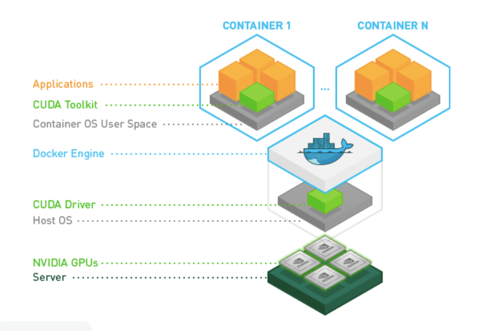
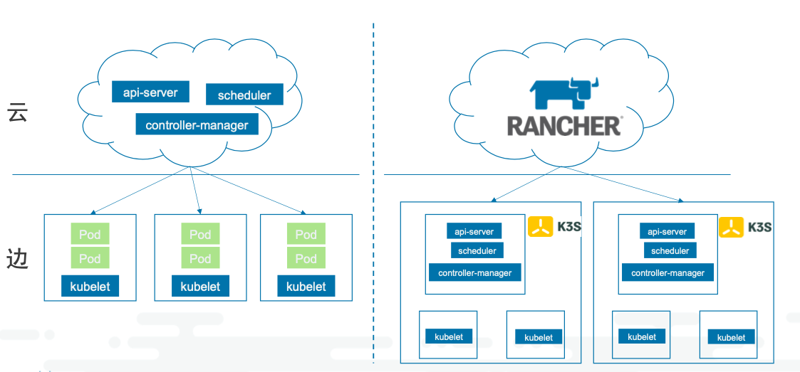
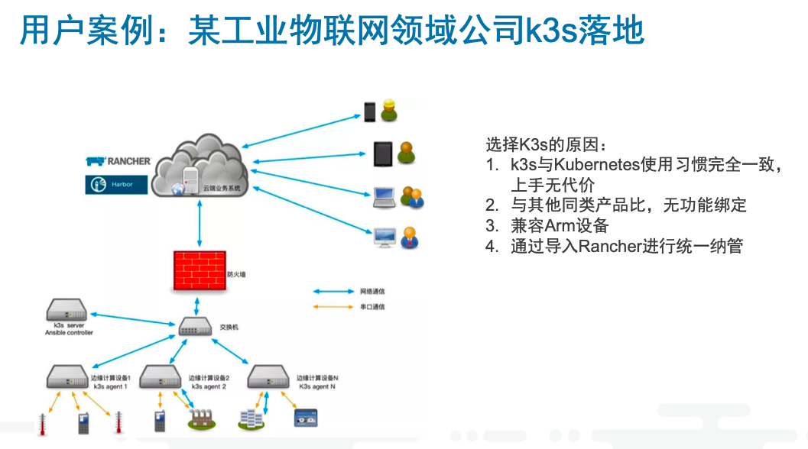
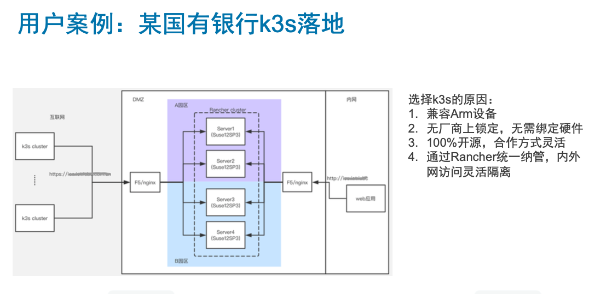
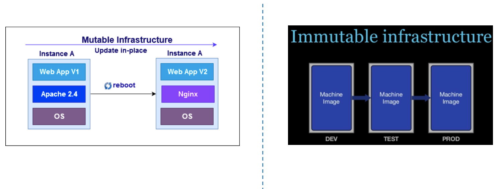
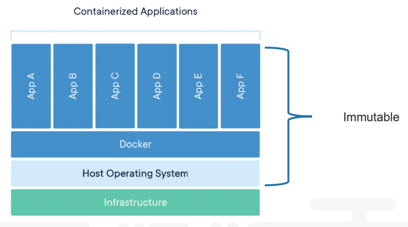
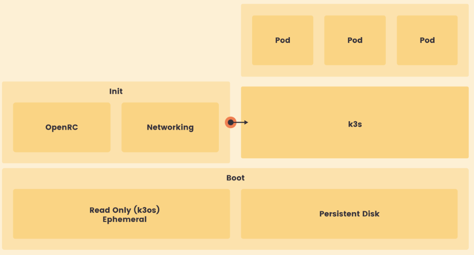

### 什么是k3s？

k3s是微型的kubernetes发行版本

1. CNCF认证的Kubernetes发行版
2. 50MB左右二进制包，500MB左右内存消耗
3. 单一进程包含Kubernetes master, Kubelet, 和 containerd 
4. 支持SQLite/Mysql/PostgreSQL/DQlite和etcd
5. 同时为x86_64, Arm64, 和 Armv7 平台发布

### k3s 基本架构

#### 整体架构

##### 部署架构


轻量化

相比k8s
移除
- 删除旧的和非必要的组件
- alpha feature
- In-tree cloud providers
- In-tree storage strivers
- Docker (optional)

增加
- 简单的安装
- etcd默认使用SQLite做数据源
- TLS管理
- 自动helm chart管理
- containerd、cordons、Flannel集成


##### k3s 代码结构


注意事项：

- contaienrd是独立进程，也可以使用docker
- Tunnel Proxy 负责维护 k3s server 和 k3s agent 之间的链接，采用Basic Auth的方式来进行认证


##### Demo

k3s 进程

- server

\# 6443 k3s server, 6444 api-server

- agent

```
pstree -p -aT $pid
ps -T $pid
```

##### 参考链接

- [k3s 代码组织结构分析参考]( https://mp.weixin.qq.com/s/1o9X0Dlv2WhUS6iC9P-KQA)
- [k3s 部署参考](https://mp.weixin.qq.com/s/V-VyWrCZux5WXxD__QpEWQ)
- [k3s 为何轻量](https://mp.weixin.qq.com/s/5aprEfYSWJyVoW4trDp4Hw)

#### k3s的高可用架构


##### 高可用 - 外置数据库

- PostgreSQL (v10.7、v11.5) ü 
- MySQL (v5.7)
- etcd (v3.3.15)

实现方式：
rancher/kine


##### 高可用 - 分布数据库

**SQLite**

- 软件库，无独立进程:C 语言编写
- 零管理配置:不需要服务管理进程
- 事务安全:兼容ACID，可并发访问
- 标准SQL支持
- 单一磁盘文件

k3s默认使用
`/var/lib/rancher/k3s/server/db/state.db`


**Dqlite**

- 软件库，无独立进程:C 语言编写
- 分布式一致:C-Raft 实现
- 兼容 SQLite

Dqlite 原理

- 一个k3sserver进程内含SQL的client组 件和 server 组件
- client 仅连接一个 server
- server 链接 SQLite 软件库
- 奇数个k3sserver进程
- client 需连接所有 server
- server 链接 Dqlite 软件库
- server 通过 C-Raft 来选主
- client 发现 主 server
- client 把请求都发送到主 server
- 主server通过C-Raft给从server发送差分日志作为数据同步


##### 参考链接

- [SQLite 基础命令](https://www.runoob.com/sqlite/sqlite-commands.html)
- [SQLite Go语言驱动实现](https://github.com/mattn/go-sqlite3)
- [CGO的动静态链接介绍](https://books.studygolang.com/advanced-go-programming-book/ch2-cgo/ch2-06-static-shared-lib.html)
- [Dqlite 讲解](https://fosdem.org/2020/schedule/event/dqlite/)
- [Raft 协议介绍](https://raft.github.io/)
- [k3s 社区高可用介绍](https://mp.weixin.qq.com/s/3by95UIJ7v41KXElt7uvGA)


#### Containerd

`Containerd`的设计目的是嵌入更大的系统

Docker的历史

- 1.8 之前:docker -d  -   2015年，OCI 成立
- 1.8 - 1.11:docker daemon - runtime-spec 制定
- 1.11以后:docker、dockerd - libcontainer -> runC
- dockerd = docker engine + containerd + containerd-shim + runC


**操作**

|镜像操作|Docker|ContainerD|
|:---|:---|:---|:---|
|本地镜像列表 |docker images |crictl images| ctr images list
|下载镜像| docker pull | crictl pull| ctr (images) pull
|上传镜像 |docker push | |ctr (images) push
|删除本地镜像 |docker rmi |crictl rmi |ctr images remove
|标记本地镜像 |docker tag | | ctr (images) tag
|镜像详情|docker inspect|crictl inspecti 
|容器列表 |docker ps |crictl ps |ctr containers list
|创建容器 |docker create |crictl create |ctr containers create
|运行容器 |docker start |crictl start |ctr (tasks) start
|停止容器 |docker stop |crictl stop |ctr (tasks) pause
|删除容器 |docker rm |crictl rm |ctr (tasks) rm
|容器详情 |docker inspect |crictl inspect
|连接容器 |docker attach |crictl attach |ctr (tasks) attach
|容器内操作 |docker exec |crictl exec |ctr (tasks) exec
|容器日志 |docker logs |crictl logs
|容器状态 |docker stats |crictl stats
|显示POD列表 ||crictl pods
|查看POD详情 ||crictl inspectp
|运行POD ||crictl runp
|停止POD ||crictl stopp
|删除POD ||crictl rmp
|转发端口到POD ||crictl port-foward
   

k3s 内置containerd

- ctr : 单纯的容器管理
- crictl : 从 Kubernetes视角出发，对POD、容器进行管理

k3s 修改containerd配置
修改`/var/lib/rancher/k3s/agent/etc/containerd/config.toml`同目录下`config.toml.tmpl`文件，重启k3s

contaienrd日志
`/var/lib/rancher/k3s/agent/containerd/containerd.log`

##### 参考链接

- [cri的演进史](https://zhuanlan.zhihu.com/p/87602649)
- [runC的介绍](https://www.infoq.cn/article/docker-standard-container-execution-engine-runc)
- [k3s 社区 Containerd 使用介绍](https://mp.weixin.qq.com/s/EJqS7G36f7_srgxSZaCuPw)
- [crictl 基本操作](https://github.com/kubernetes-sigs/cri-tools/blob/master/docs/crictl.md)
- [Containerd CNI插件配置介绍](https://github.com/containerd/cri/blob/master/docs/config.md)


### k3s拓展功能概览

#### Helm Controller

- k3s Helm Controller同时支持v2与v3版本
  - 从v1.17.0+k3s1 or above默认使用helm_v3
- Helm v2 vs Helm v3
  - 移除了Tiller(from SA to kubeconfig)
  - 三方会谈 (Three-way Strategic merge patch)
  - 使用Secret作为默认存储
  - crd-install hook迁移到了crds/路径等...
- Helm Controller的优势
  - 更方便的用户体验
  - HelmChart CRD 可以支持更丰富的拓展 
  

**设计原理**

1. Helm-controller 运行在master节点并list/watch HelmChart CRD对象
2. CRD onChange时执行Job更新
3. Job Container使用rancher/kilipper-helm为entrypoint
4. Killper-helm内置helm cli，可以安装/升级/删除对应的chart

```yaml
apiVersion: helm.cattle.io/v1
kind: HelmChart
metadata:
  name: traefik
  namespace: kube-system
spec:
  chart: stable/traefik
  set:
    rbac.enabled: "true"
    ssl.enabled: "true"
```

* K3s会自动部署在/var/lib/rancher/k3s/server/manifests路径下的HelmChart
* 通过HelmChart CRD部署的chart是兼容helm v3 CLI的
* 在k3s中管理和部署Helm应用

相关工具包
    - rancher/helm-controller
    - rancher/kilipper-helm


#### Traefik LB

K3s支持模块化的开启或关闭相关组件，例如Traefik LB, Scheduler, servicelb等

- curl -sfL https://get.k3s.io | sh -s - server --no-deploy=traefik
- k3s server --no-deploy=traefik --no-deploy=servicelb
- 也可通过修改k3s.service配置然后重启生效

##### Service LB Controller设计原理

Service LB是Rancher针对k3s集群而设计的一种service loadbalancer controller，
用户可通过将Service的type类似配置为LoadBalancer来使用。

1. svc-controller watch到service类型为LoadBalancer时，自动创建一个 Daemonset;
2. 默认Daemonset会部署到每个节点，如果任意Node设定了label svccontroller.k3s.cattle.io/enablelb=true, 
则只在拥有这个label的node上 创建DS的pod;
3. 对于某个部署的节点，一个LB port只会对应一个POD， 端口不能重复使 用;
4. 若创建失败或无可用端口时，service的状态为Pending


##### 本地存储

- K3s默认添加了local path provisioner

- Local path provisioner是基于Kubernetes Local Persistent Volume功能实现的一个本地动态存储管理器

    - 默认host path路径为/var/lib/rancher/k3s/storage
    - 配置文件存放在kube-system下的local-path-config configmap
    - 支持动态创建host path volumes
    - 不支持capacity limit


### k3s与GPU结合使用

#### 从AI视角看计算的三个层次

云计算:
- 最通用的计算
- 算力要求高，实时性要求低
- 执行复杂的认知计算和模型训练
通用操作系统/海量GPU卡


边缘计算
- 连接云和端，针对端做特定 优化
- 执行推理和数据融合处理 
通用操作系统/数量有限的GPU卡/专业AI芯片


端计算
- 场景相关性强
- 极致效率，实时性要求高 
- 主要面向推理
实时操作系统/专业AI芯片


#### Kuberntes正成为机器学习的主流基础设施平台


k3s的优势

- K3s足够轻量，减小边缘基础设施服务的资源占用
- K3s部署运维足够简单，用户可以专注GPU和计算框架的管理


#### Docker容器中的GPU




#### k3s使用GPU设备的原理

1. 操作系统安装支持Nvidia Driver
2. 安装容器运行时，并切换runtime到nvidia
3. K8s通过gpu-device-plugin来获取GPU资源并记录在k8s中
4. Pod通过在k8s内申请gpu资源，kubelet驱 动runtime把一定额度的GPU卡分配给它

```yaml
resources:
  limits:
    nvidia.com/gpu: "1"
```


##### Demo演示GPU

- 准备GPU主机，安装cuda-drivers 
- 安装nvidia-docker2
- 安装k3s
- 安装gpu-device-plugin
- 测试GPU workload


#### 当前的问题和展望

##### 容器中对GPU的资源分配还不太灵活

- GPU资源分配只能整数增减(可通过Tensorflow间接细化显存资源分配)
- NVIDIA docker不支持vGPU(kubevirt虚拟化方式可支持)

##### AI场景:云边文件传输的痛点

- 边缘AI训练特点:海量小文件IO性能要求
- 与云端同步数据的网络带宽消耗(断点续传)


### K3s的IoT场景管理

#### 什么是边缘计算?

边缘计算是指在靠近智能设备或数据源头的一端，
提供`网络`、 `存储`、`计算`、`应用`等能力，
达到*更快的网络服务响应，更安 全的本地数据传输*。

#### 边缘场景的k8s用例正在不断涌现

- 1106个有效问卷
- 15%的受访者表示，正在把Kubernetes应用在边缘计算场景中
- Chick-fil-A [Link](https://medium.com/@cfatechblog/bare-metal-k8s-clustering-at-chick-fil-a-scale-7b0607bd3541)


#### 边缘计算的问题与挑战

- 边缘设备种类繁多
- 繁琐的版本管理
- 复杂的跨域环境
- 成百上千部署在边缘侧的应用

- 统一和可持续化迭代的管理 平台
- 继承了强大的k8s社区和生 态
- 边缘节点独立自制，云端系统统一管理

#### k3s云边协作模式




#### k3s案例






#### K3s与IoT设备管理


1. 创建并纳管边缘k3s集群
2. 部署MQTT Broker到k3s集群
3. 创建、部署IoT设备相关的应用
4. 基于MQTT实现设备联动


### K3S周边介绍

#### 实例化k3s集群的工具

- K3sup(https://github.com/alexellis/k3sup) -
  VM实例中运行k3s
  - 具备隔离型，但依赖公有云服务
- K3s-ansible(https://github.com/itwars/k3s-ansible) 
  - 依赖用户对机器环境访问权限
  - 依赖ansible
- Multipass-k3s
  - 依托multipass本身对虚拟机的管理


#### K3d - 依托Docker的k3s管理工具

[k3d项目](https://github.com/rancher/k3d)

- K3s本身被置于容器中
- 容器中类似是Docker-in-Docker原理(https://hub.docker.com/_/docker)
- 实际是k3s(containerd)-in-Docker
- K3d整合各种use cases，方便通过CLI创建k3s集群

K3d带来的好处

- 管理容器一样管理k3s集群
- 给每个开发者本地k3s环境，方便调试应用
- https://github.com/rancher/k3d/tree/master/docs


#### 不可变基础设施

Immutable Infrastructure




##### VM实现了早期的构想

- VM镜像过于笨重，且无法做版本控制
- 对异构环境不友好
- 用户习惯无法被约束，依然会在线进行部分更新操作


##### 不可变基础设施1.0 --- 容器技术(Docker)

- 解决环境间差异问题 
- 快速回滚到老版本
- 更好的进行CI
- 更好的自动化
- 更容易进行大规模运维


##### 不可变基础设施2.0 -- Immutable OS

硬件之上全部为 **“不可变”**

更复杂更高级的云原生应用的更新，不仅仅依赖RootFS变更，更需要内核的同步更新。

操作系统也应成为不可变基础设施的一部分，保证基础架构更高的一致性和可靠性，以及更加方便运维管理。




##### Docker native正在向Kubernetes native演变

Immutable OS也紧跟趋势

Immutable OS for Docker: 
- RancherOS
- Atomic
- CoreOS
- Photon OS

Immutable OS for Kubernetes: 
- K3os
- Bottlerocket-os
- Talos


##### K3os – An Immutable OS For App



###### system-upgrade-controller

- 使用Kubernets方式管理OS升降级 
- 未来会集成在Rancher2.x中


#### k3c - Classic Docker for a Kubernetes world

与Docker比
1. 相似的交互
2. singlebinary
3. 同样内置containerd 4. 更加轻量化

与Crictl比
1. 满足CRI规范
2. 支持image tag/push 
3. 支持image build
